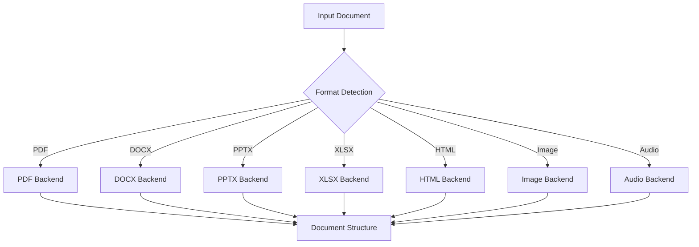

## Overview

Backends are the foundation of Docling's document processing architecture. Each backend is responsible for parsing a specific document format and extracting its raw content before pipeline processing stages (OCR, layout analysis, etc.) are applied.

## Backend Architecture

Docling uses a modular backend system where each document format has a dedicated backend implementation:



## Backend Types

Docling provides two main categories of backends:

### Declarative Backends

Declarative backends can transform documents directly to `DoclingDocument` without requiring a recognition pipeline. These backends handle well-structured formats with explicit content markup.

**Examples:**
- DOCX (Microsoft Word)
- PPTX (Microsoft PowerPoint)
- XLSX (Microsoft Excel)
- HTML
- Markdown
- AsciiDoc

**Characteristics:**
- Direct conversion to DoclingDocument
- No ML models required
- Fast processing
- Preserves document structure explicitly defined in format

### Paginated Backends

Paginated backends extract page-level content and require additional pipeline processing for layout analysis, OCR, and structure recognition.

**Examples:**
- PDF
- Images (JPEG, PNG, TIFF, etc.)

**Characteristics:**
- Extracts raw page content (text, images, metadata)
- Requires pipeline stages for structure recognition
- Supports ML-based enhancements (OCR, layout analysis)
- Page-by-page processing

## Available Backends

<CardGroup cols={2}>
  <Card title="PDF Backend" icon="file-pdf" href="/api/backends/pdf">
    Process PDF documents with advanced parsing capabilities
  </Card>
  
  <Card title="DOCX Backend" icon="file-word" href="/api/backends/docx">
    Parse Microsoft Word documents with full formatting support
  </Card>
  
  <Card title="PPTX Backend" icon="file-powerpoint" href="/api/backends/pptx">
    Extract content from PowerPoint presentations
  </Card>
  
  <Card title="XLSX Backend" icon="file-excel" href="/api/backends/xlsx">
    Process Excel spreadsheets and tables
  </Card>
  
  <Card title="HTML Backend" icon="file-code" href="/api/backends/html">
    Parse HTML documents and web pages
  </Card>
  
  <Card title="Image Backend" icon="image" href="/api/backends/image">
    Process images (JPEG, PNG, TIFF, etc.)
  </Card>
  
  <Card title="Audio Backend" icon="microphone" href="/api/backends/audio">
    Transcribe audio files using ASR
  </Card>
</CardGroup>

## Backend Interface

All backends implement the `AbstractDocumentBackend` interface:

### Core Methods

<ResponseField name="is_valid()" type="bool">
  Check if the backend successfully loaded and can process the document.
</ResponseField>

<ResponseField name="supports_pagination()" type="bool" classmethod>
  Indicates whether this backend processes documents page-by-page.
</ResponseField>

<ResponseField name="supported_formats()" type="set[InputFormat]" classmethod>
  Returns the set of input formats this backend can handle.
</ResponseField>

<ResponseField name="unload()" type="None">
  Free resources and close file handles.
</ResponseField>

### Declarative Backend Methods

<ResponseField name="convert()" type="DoclingDocument">
  Convert the document directly to a `DoclingDocument`. Only available on declarative backends.
</ResponseField>

### Paginated Backend Methods

<ResponseField name="page_count()" type="int">
  Get the total number of pages in the document. Only available on paginated backends.
</ResponseField>

<ResponseField name="load_page(page_no)" type="PageBackend">
  Load a specific page for processing. Only available on some paginated backends (PDF, Image).
</ResponseField>

## Backend Options

Each backend can be configured with format-specific options:

```python
from docling.document_converter import DocumentConverter, PdfFormatOption
from docling.datamodel.backend_options import PdfBackendOptions
from pydantic import SecretStr

# Configure PDF backend
pdf_backend_options = PdfBackendOptions(
    password=SecretStr("secret123")
)

converter = DocumentConverter(
    format_options={
        PdfFormatOption: PdfFormatOption(
            backend_options=pdf_backend_options
        )
    }
)
```

See individual backend pages for format-specific options.

## Choosing the Right Backend

Docling automatically selects the appropriate backend based on file extension and MIME type. However, understanding backend characteristics helps optimize performance:

<AccordionGroup>
  <Accordion title="For Document Conversion">
    **Use DOCX, HTML, or Markdown backends** when:
    - Source format explicitly defines structure
    - No OCR or layout analysis needed
    - Fast processing is priority
    - Preserving exact formatting is important
  </Accordion>
  
  <Accordion title="For Scanned Documents">
    **Use PDF or Image backends** when:
    - Documents are scanned or image-based
    - OCR is required
    - Layout analysis needed for structure detection
    - Processing historical or archival documents
  </Accordion>
  
  <Accordion title="For Data Extraction">
    **Use XLSX backend** when:
    - Extracting tabular data from spreadsheets
    - Processing financial reports or data exports
    - Working with structured data in Excel format
  </Accordion>
  
  <Accordion title="For Presentations">
    **Use PPTX backend** when:
    - Converting slide decks to structured format
    - Extracting presentation content
    - Processing training materials or reports
  </Accordion>
  
  <Accordion title="For Web Content">
    **Use HTML backend** when:
    - Processing web pages or HTML exports
    - Converting documentation sites
    - Handling markdown-rendered HTML
  </Accordion>
  
  <Accordion title="For Audio/Video">
    **Use Audio backend** when:
    - Transcribing recorded meetings or interviews
    - Processing podcast or lecture audio
    - Converting speech to text
  </Accordion>
</AccordionGroup>

## Backend Lifecycle

Typical backend lifecycle during document processing:

<Steps>
  <Step title="Initialization">
    Backend is created with input document and options:
    
    ```python
    backend = PdfDocumentBackend(
        in_doc=input_document,
        path_or_stream=file_path,
        options=backend_options
    )
    ```
  </Step>
  
  <Step title="Validation">
    Check if backend successfully loaded:
    
    ```python
    if not backend.is_valid():
        raise RuntimeError("Failed to load document")
    ```
  </Step>
  
  <Step title="Processing">
    **Declarative backends:**
    ```python
    doc = backend.convert()
    ```
    
    **Paginated backends:**
    ```python
    for page_no in range(backend.page_count()):
        page = backend.load_page(page_no)
        # Process page through pipeline
    ```
  </Step>
  
  <Step title="Cleanup">
    Free resources:
    
    ```python
    backend.unload()
    ```
  </Step>
</Steps>

## Thread Safety

Backend thread-safety considerations:

- **Initialization:** Backends should be created per-thread or protected by locks
- **Page Loading (PDF/Image):** Page backends are designed for concurrent access
- **Resource Management:** Call `unload()` when done to free resources

```python
import concurrent.futures

def process_page(backend, page_no):
    page = backend.load_page(page_no)
    # Process page
    page.unload()

# Safe: Load pages concurrently
backend = PdfDocumentBackend(...)
with concurrent.futures.ThreadPoolExecutor() as executor:
    futures = [
        executor.submit(process_page, backend, i)
        for i in range(backend.page_count())
    ]
    results = [f.result() for f in futures]

backend.unload()
```

## Custom Backends

Docling's backend system is extensible. To implement a custom backend:

1. Inherit from `AbstractDocumentBackend`, `DeclarativeDocumentBackend`, or `PaginatedDocumentBackend`
2. Implement required abstract methods
3. Register backend with DocumentConverter

```python
from docling.backend.abstract_backend import DeclarativeDocumentBackend
from docling.datamodel.base_models import InputFormat
from docling_core.types.doc import DoclingDocument

class MyCustomBackend(DeclarativeDocumentBackend):
    @classmethod
    def supported_formats(cls):
        return {InputFormat.CUSTOM}
    
    def is_valid(self):
        return True
    
    @classmethod
    def supports_pagination(cls):
        return False
    
    def convert(self) -> DoclingDocument:
        # Implement conversion logic
        pass
```

## See Also

- [PDF Backend](/api/backends/pdf) - PDF processing details
- [DOCX Backend](/api/backends/docx) - Word document processing
- [Pipeline Options](/api/options/pipeline-options) - Configure pipeline stages
- [DocumentConverter](/api/document-converter) - Main conversion API