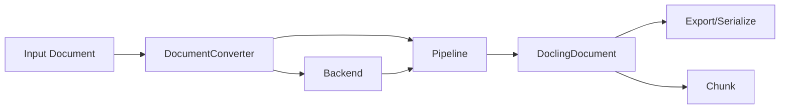

## Overview

Docling's architecture is built on a modular design that separates concerns between document parsing, processing pipelines, and output generation. The system is designed to handle multiple document formats through a unified interface while maintaining flexibility and extensibility.

## Core Components

The architecture consists of four main components that work together to convert documents:

### 1. Document Converter

The `DocumentConverter` class (`docling/document_converter.py:198`) is the main entry point for all document conversions. It:

- Manages format-specific configurations through `FormatOption` mappings
- Routes documents to appropriate backends and pipelines based on input format
- Caches initialized pipelines for performance (keyed by pipeline class and options hash)
- Handles both single-document (`convert()`) and batch conversion (`convert_all()`)

```python
from docling.document_converter import DocumentConverter

converter = DocumentConverter()
result = converter.convert("document.pdf")
```

### 2. Backends

Backends are format-specific parsers that extract raw content from input documents. See [Backend Architecture](/concepts/backends) for details.

**Key backend types:**
- **Declarative backends**: Directly produce `DoclingDocument` (DOCX, HTML, Markdown, etc.)
- **Paginated backends**: Provide page-level access for pipeline processing (PDF, images)

### 3. Pipelines

Pipelines orchestrate the conversion process, applying ML models and transformations to create structured output. See [Pipeline Concepts](/concepts/pipelines) for details.

**Main pipeline types:**
- `SimplePipeline`: For declarative backends that output documents directly
- `StandardPdfPipeline`: Multi-threaded PDF processing with OCR, layout analysis, and table extraction
- `VlmPipeline`: Vision-language model based conversion
- `AsrPipeline`: Audio transcription and conversion

### 4. DoclingDocument

The unified document representation format that all conversions produce. See [DoclingDocument](/concepts/docling-document) for details.

## Conversion Flow

The typical document conversion follows this flow:

<Steps>
  <Step title="Format Detection">
    The `DocumentConverter` identifies the input format and retrieves the corresponding `FormatOption` configuration.
  </Step>
  
  <Step title="Backend Initialization">
    A format-specific backend is instantiated to parse the input document (e.g., `DoclingParseDocumentBackend` for PDFs).
  </Step>
  
  <Step title="Pipeline Execution">
    The pipeline orchestrates the conversion:
    - **Build**: Extract content using the backend
    - **Assemble**: Structure content into a `DoclingDocument`
    - **Enrich**: Apply ML models for enhancement (optional)
  </Step>
  
  <Step title="Output Generation">
    The `ConversionResult` contains the final `DoclingDocument` and metadata, ready for export or further processing.
  </Step>
</Steps>



## Pipeline Stages

For complex formats like PDF, pipelines execute multiple stages:

1. **Page Initialization**: Load page-level backends and extract raw content
2. **Preprocessing**: Scale images, prepare for model input
3. **OCR**: Text recognition for scanned or image-based content
4. **Layout Analysis**: Detect document structure (headings, paragraphs, tables, figures)
5. **Table Structure**: Parse table cells and relationships
6. **Assembly**: Combine page elements into a unified document
7. **Enrichment**: Apply optional models (picture classification, chart extraction, etc.)

<Note>
The `StandardPdfPipeline` executes these stages in parallel across multiple threads for optimal performance. Pages are processed in batches with configurable concurrency.
</Note>

## Format-to-Pipeline Mapping

Each input format has a default backend and pipeline configuration:

| Format | Backend | Pipeline | Purpose |
|--------|---------|----------|----------|
| PDF | `DoclingParseDocumentBackend` | `StandardPdfPipeline` | Full PDF processing with OCR and layout |
| IMAGE | `ImageDocumentBackend` | `StandardPdfPipeline` | Image-based document conversion |
| DOCX | `MsWordDocumentBackend` | `SimplePipeline` | Microsoft Word documents |
| HTML | `HTMLDocumentBackend` | `SimplePipeline` | Web content |
| MD | `MarkdownDocumentBackend` | `SimplePipeline` | Markdown files |
| AUDIO | `NoOpBackend` | `AsrPipeline` | Speech-to-text transcription |

<Tip>
You can override the default mappings by providing custom `format_options` when initializing `DocumentConverter`. This allows you to use different backends or pipeline configurations for specific formats.
</Tip>

## Extensibility

Docling's architecture supports extension through:

- **Custom backends**: Implement `AbstractDocumentBackend` for new formats
- **Custom pipelines**: Subclass `BasePipeline` for specialized processing
- **Plugin models**: Add ML models via the plugin system
- **Custom serializers**: Define new export formats

See the [Plugins](/concepts/plugins) documentation for details on extending Docling.

## Performance Considerations

### Pipeline Caching

The `DocumentConverter` caches initialized pipelines using a composite key of `(pipeline_class, options_hash)`. This means:

- Pipelines with identical configurations are reused across documents
- Heavy ML models are loaded once per pipeline instance
- Thread-safe access ensures concurrent conversions can share pipelines

### Batch Processing

For optimal throughput when processing multiple documents:

```python
converter = DocumentConverter()
sources = ["doc1.pdf", "doc2.pdf", "doc3.pdf"]

for result in converter.convert_all(sources):
    # Process results as they complete
    print(f"Converted: {result.input.file}")
```

Batch processing enables:
- Document-level parallelism (configurable via `settings.perf.doc_batch_concurrency`)
- Efficient resource utilization
- Pipeline sharing across documents

## References

<CardGroup cols={2}>
  <Card title="Docling Technical Report" icon="file-pdf" href="https://arxiv.org/abs/2408.09869">
    Deep dive into Docling's architecture and design decisions
  </Card>
  
  <Card title="Backend Architecture" icon="server" href="/concepts/backends">
    Learn about format-specific document backends
  </Card>
  
  <Card title="Pipeline Concepts" icon="diagram-project" href="/concepts/pipelines">
    Understand pipeline orchestration and processing
  </Card>
  
  <Card title="DoclingDocument" icon="file-code" href="/concepts/docling-document">
    Explore the unified document representation
  </Card>
</CardGroup>